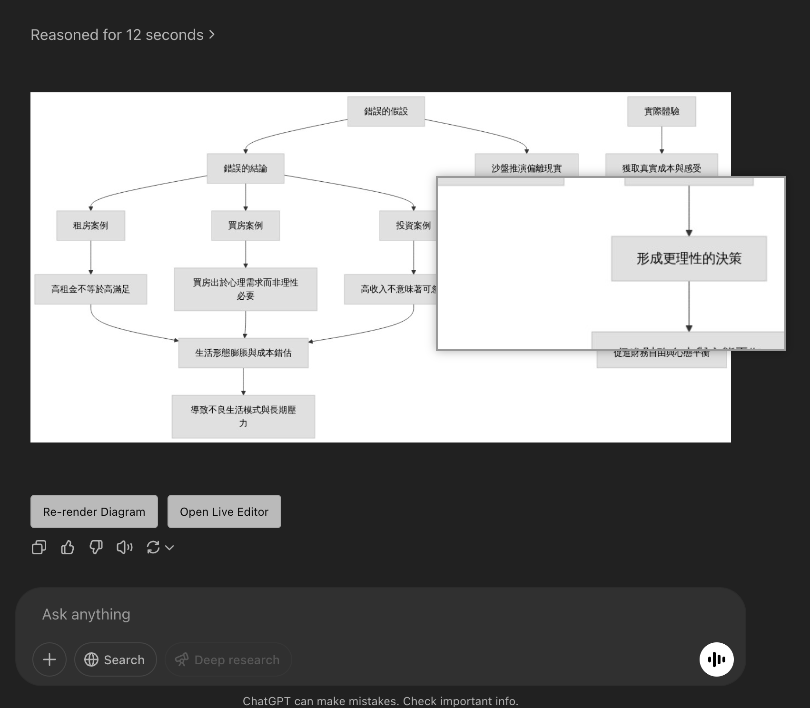

# Mermaid 擴充功能

這是一個瀏覽器擴充功能，用於增強網頁上的 Mermaid 圖表功能。

## 範例展示

## 功能

- 在網頁中增強 Mermaid 圖表的顯示
- 支援 Mermaid 語法的即時渲染
- 提供更好的使用者體驗
- 圖表放大鏡功能，點擊圖表可以啟用1.5倍放大鏡查看細節

## 檔案說明

- `manifest.json`: 擴充功能的配置檔案
- `content.js`: 內容腳本，用於與網頁互動
- `injected.js`: 注入到網頁的腳本，處理 Mermaid 圖表
- `pako.min.js`: 壓縮庫
- `sample.png`: 示例圖片

## 如何安裝

1. 下載此專案
2. 在瀏覽器中開啟擴充功能頁面
3. 啟用開發者模式
4. 選擇「載入未封裝的擴充功能」並選取此專案資料夾

## 使用說明

1. 安裝擴充功能後，網頁上的 Mermaid 圖表會自動渲染
2. 點擊圖表可以啟用放大鏡功能，再次點擊關閉
3. 滑鼠在圖表上移動時，放大鏡會跟隨顯示細節內容
4. 放大鏡大小為圖片的50%，提供1.5倍放大效果
5. 放大鏡中心顯示的內容與滑鼠位置精確對應

## 開發

可依照需求修改 `content.js` 和 `injected.js` 檔案來自定義功能。放大鏡的尺寸和放大倍率可在 `injected.js` 中調整。

## 授權

MIT 